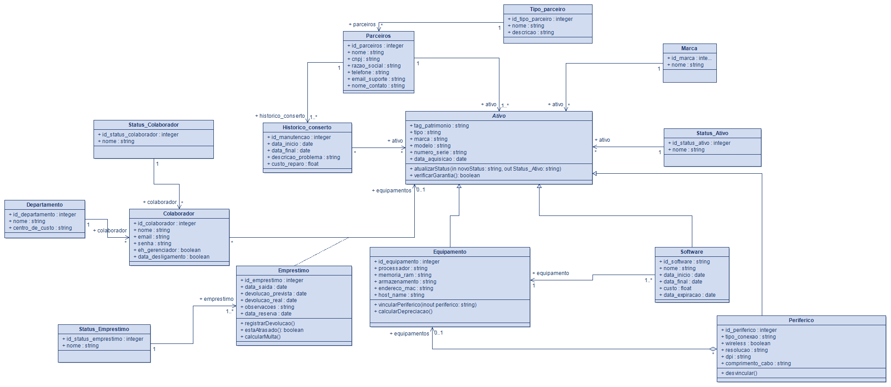

# 💧 AquaAssets

> **Gestão transparente e eficiente de ativos de TI.**

O **AquaAssets** é um sistema web desenvolvido para gerenciar o ciclo de vida completo de ativos de tecnologia (hardwares, softwares e periféricos) dentro de uma organização. Ele permite o controle de empréstimos para colaboradores, rastreamento de manutenções e organização de equipamentos por departamento e status.

---

### 🚀 Funcionalidades Principais

Baseado na modelagem relacional do sistema, o AquaAssets oferece:
- **Gestão de Inventário:** Cadastro detalhado de Ativos, segmentados por `Equipamentos` (com dados de RAM, Processador, MAC), `Softwares` (licenças e vencimentos) e `Periféricos`.
- **Controle de Empréstimos:** Vinculação de ativos a `Colaboradores` e `Departamentos`, com rastreamento de datas de saída, devolução prevista e cálculo de multas/atrasos.
- **Histórico de Manutenção:** Registro de `Consertos`, documentando o problema, custo do reparo e vinculação com empresas `Parceiras` (fornecedores/assistências).
- **Rastreabilidade:** Controle de `Marcas`, `Status do Ativo` (Ativo, Em Manutenção, Desativado) e `Status do Colaborador`.

---

### 🛠️ Tecnologias e Arquitetura

O projeto foi construído utilizando o padrão de arquitetura **MVC (Model-View-Controller)** para garantir separação de responsabilidades e código limpo.

* **Back-end:** PHP 8.4
* **Banco de Dados:** SQL Server
* **Front-end:** Tailwind CSS
* **Template Engine:** Plates
* **Modelagem:** Orientação a Objetos (POO) e Diagrama de Classes UML.

---

### 📊 Modelagem do Banco de Dados (UML)

Abaixo está o diagrama de classes e entidade-relacionamento que baseia a estrutura do AquaAssets, demonstrando os relacionamentos e heranças do sistema:



---

### ⚙️ Como rodar o projeto localmente

1. **Clone o repositório**:
   `git clone https://github.com/LongFire788/AquaAssets.git`

2. **Instale as dependências** (necessário Composer):
   `composer install`

3.  **Inicie o servidor**:
   `php -S localhost:8000 -t public`

Nota: Este projeto está em desenvolvimento ativo. No momento, o setup foca na estrutura do código PHP e na interface Tailwind. Instruções de banco de dados serão integradas conforme a evolução das migrations.

---

### 👨‍💻 Autor

**Eduardo de Celis**  
Estudante de Análise e Desenvolvimento de Sistemas.

[](https://www.linkedin.com/in/eduardo-celis-18472823b)
[](https://github.com/LongFire788)


**Clone este repositório:**
   ```bash
   git clone [https://github.com/LongFire788/AquaAssets.git](https://github.com/LongFire788/AquaAssets.git)

